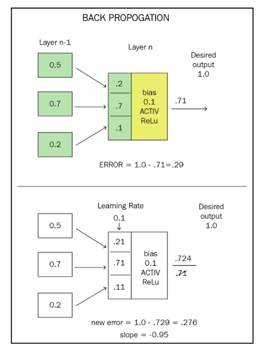

# Подглава 4.7 Процесс свертки нейронной сети

Я хочу предоставить вам полноценный взгляд на то, что мы будем делать в коде до конца этой главы. Помните, что мы строим сверточную нейронную сеть \(CNN\), которая исследует объекты в кадре и выводит сообщение, если на изображении есть одна или несколько игрушек, а также определяет, где они находятся:

Вот краткий обзор процесса:

* Подготовим обучающий набор изображений комнаты с игрушками и без.
* Помечаем область изображений с игрушками, в отдельной папке.
* Помечаем изображения, на которых нет игрушек, в отдельной папке.
* Разбиваем обучающий набор на две части: набор, который мы используем для обучения сети, и набор, который мы используем для тестирования сети.
* Мы будем создавать две программы: программу обучения, которая запускается на вашем рабочем столе компьютера и обучает сеть, и рабочую программу, которая использует обученную сеть для поиска игрушек.
* Программа 1: Обучаем сеть \(toyTrainNetwork.py\).
* Мы берем каждое изображение и умножаем его обучающее значение путем случайного масштабирования, вращения и переворачивания \(зеркального отображения\) изображений. Это увеличивает наш обучающий набор в 20 раз:

* Мы строим нашу свёрточную нейронную сеть \(CNN\) с уровнем свёртки, уровнем максимального пула \(maxpooling layer\), другим уровнем свёртки, другим уровнем максимального пула, затем полностью подключенным уровнем и выходным уровнем. Этот тип CNN называют _**LeNet**_.
* Сейчас мы уменьшаем все наши изображения, чтобы уменьшить объем обработки.
* Сеть инициализируется со случайными весами.
* Мы представляем помеченное изображение в сети. Мы получаем ответ, или правильный, или нет. Если он правильный, мы усиливаем веса на входах, которые способствовали этому ответу, увеличивая их \(обучающие значения\). Если ответ неверный, мы уменьшаем вес. В нейронных сетях ошибка между желаемым результатом и фактическим называется _**потерей**_.
*  Повторяем для каждого изображения.
* Теперь мы тестируем сеть, запуская тестовый набор изображений — это изображения тех же игрушек, но их не было в обучающем наборе. Мы видим, какой вывод мы получаем на основе этого набора \(сколько неправильных, сколько правильных\). Если этот ответ выше 90%, мы останавливаемся. В противном случае мы возвращаемся и снова запускаем все обучающие наборы.
* Как только мы довольны результатами — и нам нужно от 100 до 500 итераций, чтобы достичь цели, — мы останавливаемся и сохраняем веса, с которыми мы закончили в обучающей сети. Это наша  обученная свёрточная нейронная сеть \(CNN\).
* Программа 2: Находим игрушки \(ToyFindNetwork.pyp\).
* Теперь мы развернем обученную сеть, загружая ее и используя наши видео-изображения с реального робота для поиска игрушек. Мы получим вероятность изображения с игрушкой от 0 до 100%. Мы сканируем входное видео-изображение по секциям и находим, какие секции содержат игрушки. Если мы недовольны этой сетью, мы можем перезагрузить эту сеть в обучающую программу и обучить ее еще немного.
* Готово!


Теперь давайте рассмотрим это подробно, шаг за шагом. У нас есть немного больше теории, которую нужно охватить прежде, чем мы начнем писать код.

Наша первая задача — подготовить обучающий набор. Мы ставим камеру на робота и управляем роботом с помощью телеоперационного интерфейса \(или просто перемещая его вручную\), делая моментальные снимки каждый фут или около того. Нам нужно сделать как минимум два прохода: один с игрушками в комнате и один — без. Нам нужно около 200 фотографий в каждую сторону, и чем больше, тем лучше. Также нам нужно сделать серию снимков в дневное время при естественном освещении и ночью, если ваша комната меняет освещение между днем и ночью. Это дает нам несколько преимуществ: мы используем одну и ту же комнату и одну и ту же камеру для поиска игрушек, и в одинаковых условиях освещения.

Теперь нам нужно пометить изображения. Я использовал небольшую программу под названием _**LabelImg**_, которая доступна на github/tzutalin/labelImg. Эта программа создает границы помеченных объектов в формате данных ImageNet. ImageNet является популярным набором данных, используемым в соревнованиях между классификаторами изображений и содержит 1000 типов помеченных объектов. Мы должны сделать это сами. Загрузите бинарную версию LabelImg и запустите ее. Используйте команду Open Dir, чтобы выбрать каталог с вашими изображениями игрушек. Будет показана первая картинка.

Для нас процесс довольно прост. Мы по очереди смотрим на каждую картинку и рисуем обводку вокруг любой игрушки. Используйте клавишу быстрого доступа _W_ с каждым окном. Откроется диалоговое окно метки. В первом случае вам нужно будет ввести toy в качестве пометки. Мы помечаем это, как вы можете догадаться, _toy_. Мы также обводим объекты, не являющиеся игрушками, и помечаем их как _not\_toy_. Это займет некоторое время. Мы помещаем готовый продукт, который представляет собой XML-файл, в папку, названную _data_. Нам нужно будет преобразовать XML-файл в CSV в нашу программу обучения классификатора.

В следующем разделе мы напишем нашу обучающую сеть программу на основе Keras/Tensorflow, но на данный момент давайте поговорим о том, что мы собираемся сделать в первую очередь. Программа будет считывать изображения по одному, а затем создавать дополнительные изображения путем случайного поворота, масштабирования, переворачивания, перевода и добавления шума к изображениям. Теперь наши 200 изображений сделают работу 2000 изображений.

Мы создаем нашу _**сверточную нейронную сеть \(CNN\)**_ с пакетом разработки ИИ под названием _**Keras**_. Первым шагом является создание _**последовательной**_ сетевой структуры включения уровней. Последовательные сети являются наиболее распространенной топологией, используемой для нейронных сетей, указывающих на то, что сеть состоит из уровней, каждый из которых связан с уровнем выше и уровнем ниже, и нигде больше. Мы строим пятиуровневую сеть. Первая сеть является _**уровнем свёртки**_. Мы будем использовать 20 свёрток и матрицу свёртки 5 x 5, которая просматривает два соседних пикселя вокруг каждого пикселя для проявления особенностей. Keras определит, какие ядра свёртки использовать. Мы указываем отступ, соответствующий размеру свёртки, который добавляет две строки пикселей ко всем четырем сторонам нашего изображения, чтобы мы не выходили за пределы погрешностей. Затем мы должны добавить _**активационную функцию**_ для этого уровня, которая будет функцией _**Rectifier Linear Unit**_, или _**ReLU**_, которая просто перенаправляет все значения больше нуля и возвращает ноль в противном случае.

Следующий уровень — это уровень максимального пула, который мы установим как 2 x 2 с шагом 2 x 2. Это преобразует блоки из четырех пикселей в один пиксель и извлекает максимальное значение из четырех пикселей, что сохраняет особенности изображения. Этот уровень уменьшает размер изображения до одной четверти от его первоначального размера, что увеличивает скорость нашей сети и позволяет следующему уровню распознавать более крупные объекты в изображении. Если первый уровень распознает шины на наших игрушечных автомобилях, второй уровень после максимального пула будет искать окна, капоты и автомобильные багажники.

Третий уровень снова является свёрткой с использованием уменьшенного размера изображения в качестве входных данных. Этот уровень должен иметь вдвое больше свёрток, чем первый, поэтому он имеет 40 свёрток и снова использует размер ядра 5 x 5. Мы снова используем активационную функцию ReLU для этого уровня.

Мы добавляем уровень максимального пула размером 2 x 2 после второй свёртки, как и первый.

Теперь мы объединим наши данные в единый набор чисел, чтобы подготовить их к выводу. Мы используем функцию выравнивания Keras, а затем добавляем плотно связанный или полностью связанный уровень для пятого уровня. Мы должны перейти от изображения к двоичному значению «да» или «нет», и поэтому мы сглаживаем данные, чтобы преобразовать изображение в строку чисел.

Последний уровень – это наш выходной уровень, в котором есть только два нейрона – один для игрушки и один не для игрушки, которые являются нашими двумя классами объектов, которые мы будем идентифицировать. Мы даем сетевому конструктору наше количество классов – два, и устанавливаем его активацию на SoftMax. _**SoftMax**_ преобразует выходные данные каждого из наших классов в число от 0 до 1, а затем делит выходные значения так, чтобы сумма всех выходных значений равнялась 1. Поскольку у нас есть только два класса, мы могли бы использовать функцию сигмоида \(_sigmoid_\), но функция активации SoftMax является более общей и позволит нам добавлять больше классов позже, если мы хотим. В результате мы получим два числа – прогнозируемую вероятность того, что изображение содержит игрушку, и вероятность того, что изображение не содержит игрушку. Итоговое значение будет иметь значение до 1, поэтому если вероятность _toy_ равна 0.9, то вероятность _not\_toy_ будет равна 0.1.

Последние два шага в построении нашей сети – указать нашу потерю или функцию ошибки и выбрать оптимизатор обучения. Функция потерь – это то, как мы вычисляем ошибку или потерю из сети. Каждый проход сети будет представлен с изображением, которое либо содержит игрушку, либо нет. Мы пометили изображения так, чтобы программа знала, что есть что – мне нравится думать об этом как о значении «истина». Сеть анализирует изображение и выдает наши два числа – значения «игрушка» и «не игрушка». Наша ошибка – разница между истинным значением и предсказанным. Если значение игрушки – истина или 1.0, а прогноз игрушки равен 0.9, то наша потеря – 0.1. Если изображение не содержит игрушку, а мы все равно получили 0.9, то ошибка будет 0.9. Поскольку мы используем много данных, чтобы прийти к этому единственному числу, мы должны иметь возможность распределить ошибку на отдельные нейроны. Мы выберем бинарный расчет потерь перекрестной энтропии или кросс-энтропии \(_**binary** **cross** **entropy**_\), который, как было показано, хорошо работает с такой проблемой при существовании только двух классов.

То, как мы используем эту информацию в нашем обучении, является ролью или оптимизатором обучения. Мы будем использовать оптимизатор ADAM для этого примера, который является улучшенной версией _**стохастического градиентного спуска** \(**SGD**\)_. SGD – еще одна из тех простых концепций с причудливым названием. Стохастический означает случайный. То, что мы хотим сделать, это настроить веса наших нейронов, чтобы дать ответ лучше, чем мы получили в первый раз – это то, что мы тренируем, корректируя веса. Мы хотим немного изменить вес, но в каком направлении? Мы хотим изменить вес в направлении, которое улучшает ответ, это делает прогноз ближе к истине.

Давайте сделаем небольшой мысленный эксперимент. У нас есть нейрон, который, как мы знаем, дает неверный ответ и нуждается в корректировке. Мы добавляем небольшое количество к весу и видим, как меняется ответ. Становится немного хуже – число еще дальше от правильного ответа. Поэтому вместо этого мы вычитаем небольшое количество – и, как вы могли подумать, ответ становится лучше. Мы немного уменьшили количество ошибок. Если мы сделаем график ошибки, вызванной нейроном, мы движемся к ошибке в нуле, или мы спускаемся по графику к некоторому минимальному значению. Размер уклона можно назвать градиентом – так же, как вы бы назвали уклон или крутизну холма градиентом. Мы можем вычислить частную производную \(другими словами, уклон линии около этой точки или угловой коэффициент\), и это говорит нам о наклоне линии.

Способ корректировки весов в сети в целом называется _**методом обратного распространения ошибки** \(**backpropagation**\)_. Это потому, что, как вы можете догадаться, мы должны начать с конца сети – где мы знаем, каким должен быть ответ, и продолжать свой путь к началу. Мы должны рассчитать вклад каждого нейрона в нужный нам ответ и немного откорректировать его \(показатель обучения\) в правильном направлении, чтобы каждый раз двигаться к правильному ответу. Мы возвращаемся к идее нейрона – у нас есть входы, веса для каждого входа, уклон, и затем активационная функция для получения выхода. Если мы знаем, что на выходе, мы можем работать в обратном направлении через нейрон, чтобы отрегулировать веса. Давайте возьмем простой пример. Вот нейрон с тремя входами Y1, Y2 и Y3. У нас есть три веса – W1, W2 и W3. У нас будет уклон B и наша функция активации D, которая является «выпрямителем» ReLU. Наши входные данные составляют 0.2, 0.7 и 0.02. Веса составляют 0.3, 0.2 и 0.5. Наш уклон составляет 0.3, а желаемый результат равен 1.0. Мы рассчитываем сумму входных данных и весов, и получаем значение 0.21. Добавив наш уклон, мы получаем 0.51. Функция ReLU передает любое значение больше нуля, поэтому активированный выход этого нейрона равен 0.51. Наше желаемое значение равно 1.0, что исходит из истинных данных. Итак, наша ошибка 0.49. Если мы добавим значение показателя обучения к каждому весу, что произойдет? Изучите следующую схему:

Выходное значение теперь увеличивается до 0.5192. Наша потеря снижается до 0.4808. Мы на правильном пути! Градиент нашей ошибки уклона составляет $$(.4808 - .49) / 1 = -0.97$$. Единица – потому, что у нас пока только один тренировочный образец. Откуда берется стохастическая часть? Наша сеть распознавания может иметь 50 миллионов нейронов. Мы не можем делать всю эту математику для каждого. Поэтому мы выбираем случайную выборку входных данных, а не все, чтобы определить является ли наше обучение точным или нет.

В математических терминах уклон уравнения \(угловой коэффициент\) определяется производной этого уравнения. Таким образом, на практике метод обратного распространения ошибки использует частную производную ошибки между периодами обучения, чтобы определить уклон ошибки и, таким образом, определить, правильно ли мы обучаем нашу сеть. По мере того, как уклон уменьшается, мы уменьшаем наш показатель обучения до меньшего числа, чтобы приблизиться к правильному ответу:


  
Наша следующая проблема: как мы поднимаемся по уровням. Здесь, на выходе нейрона мы видим, как мы определяем ошибку – просто значение метки минус выход сети. Как мы применим эту информацию к предыдущему уровню? Вклад каждого нейрона в ошибку пропорционален его весу. Мы делим ошибку на вес каждого входа, и теперь это значение является прикладной ошибкой следующего нейрона в цепочке. Затем мы можем пересчитать их вес и так далее. Вы начинаете понимать, почему нейронные сети потребляют так много вычислительной мощности:

